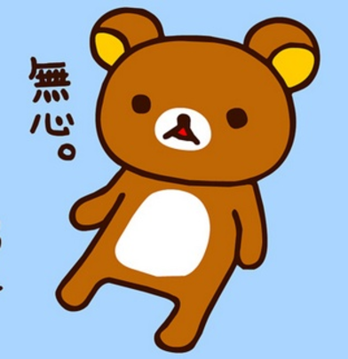

preview 取 session 的程式

```php
<div class="main">
        _<?=$_SESSION['photo']['name']?>" class="cir-pic">
        <h2><span><?=$_SESSION['name']?></span></h2>
        <h3><span><?=$_SESSION['position']?></span></h3>
        <h3><span><?=$_SESSION['skills']?></span></h3>
        <h3><span><?=$_SESSION['phone']?></span></h3>
        <h3><span><?=$_SESSION['email']?></span></h3>
        <h3><span><?=$_SESSION['template']?></span></h3>
    </div>
```
還有這是PHP前面session下的
```php
<?php
session_start();
if(empty($_SESSION)) header('location:index.php');
var_dump($_SESSION);

?>
```
這是做CSS用的假資料  
```php
<div class="main">
        
        <span class="name">Reira江盈蓉</span>
        <span class="pos-title">菜鳥工程師</span>
        <span class="skill">甚麼都不會的菜鳥/還要分行/再度分行</span>
        <span class="phone">0966-720-315</span>
        <span class="email">wjyr0315@gmail.com</span>
    </div>
```

完整版的
```html
<?php 
session_start();
?>
<!DOCTYPE html>
<html lang="en">

<head>
    <meta charset="UTF-8">
    <meta name="viewport" content="width=device-width, initial-scale=1.0">
    <meta http-equiv="X-UA-Compatible" content="ie=edge">
    <title>vCard</title>
    <link rel="stylesheet" href="template/T1.css">
   
</head>

<body>

    <div class="main">
        
        <span class="name">Reira江盈蓉</span>
        <span class="pos-title">菜鳥工程師</span>
        <span class="skill">甚麼都不會的菜鳥/還要分行/再度分行</span>
        <span class="phone">0966-720-315</span>
        <span class="email">wjyr0315@gmail.com</span>
    </div>

    
</body>

</html>
```